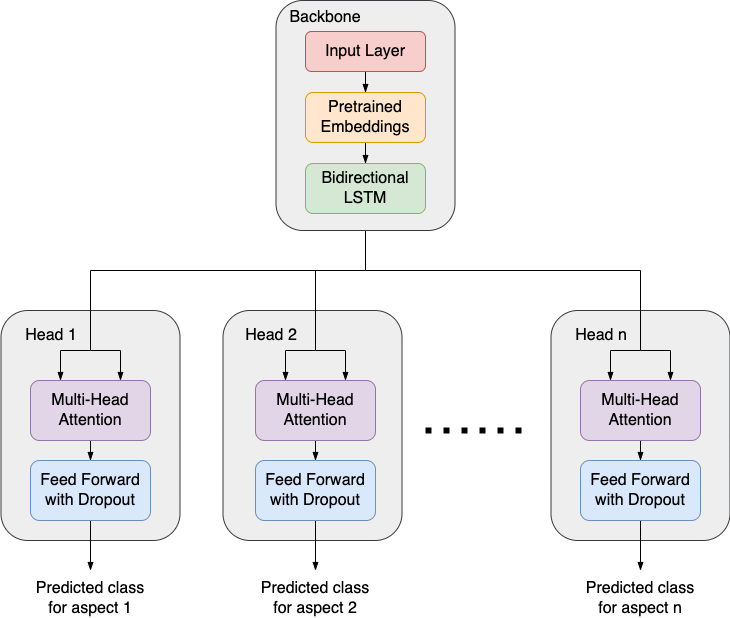

# Aspect Based Sentiment Analysis (ABSA) for Restaurant Reviews

This is a proof-of-concept implementation of aspect based sentiment analysis using multi-task learning. The model architecture was taken from Eram Munawwar's [blog post](https://medium.com/analytics-vidhya/aspect-based-sentiment-analysis-5a78d4cba1b1).



The prototype neural network model was trained on ~3000 restaurant reviews with polarity labels over 5 different aspects. The model achieved a test accuracy of 0.7442 compared against the majority baseline of 0.6409.


## Installation
Python >3.8 is required.

```
virtualenv absa_env
source absa_env/bin/activate
pip install -r requirements.txt
python -m spacy download en_core_web_md
```

## Commands
`python src/make_reviews.py` will process the restaurant review data and export it into parquet format.

`python src/train.py` will train a multi-task neural network model for sentiment analysis.

`python src/debug_dataset.py` can be used for debugging the process of datasets creation.

`python src/debug_model.py` can be used for debugging the network architecture.


## Source data
* [SemEval-2014 Task 4](https://alt.qcri.org/semeval2014/task4/index.php?id=data-and-tools)
* [SemEval-2014 ABSA Test Data - Gold Annotations](http://metashare.elda.org/repository/browse/semeval-2014-absa-test-data-gold-annotations/b98d11cec18211e38229842b2b6a04d77591d40acd7542b7af823a54fb03a155/)
* [SemEval-2016 Task 5](https://alt.qcri.org/semeval2016/task5/index.php?id=data-and-tools)(Optional)


## References
* Tunstall, L., Werra, L. von, &amp; Wolf, T. (2022). Natural language processing with transformers, Revised edition. O'Reilly Media, Inc.
* [Aspect Based Sentiment Analysis](https://medium.com/analytics-vidhya/aspect-based-sentiment-analysis-5a78d4cba1b1)
* [Splitting a Dataset for Machine Learning](https://madewithml.com/courses/mlops/splitting/)
* [SemEval-2014 Task 4: Aspect Based Sentiment Analysis](https://aclanthology.org/S14-2004.pdf)
* [SemEval-2016 Task 5: Aspect Based Sentiment Analysis](https://aclanthology.org/S16-1002.pdf)
* [A detailed example of how to generate your data in parallel with PyTorch](https://stanford.edu/~shervine/blog/pytorch-how-to-generate-data-parallel)
* [RANZCR: Multi-Head Model [training]](https://www.kaggle.com/code/ttahara/ranzcr-multi-head-model-training)
* [Tutorial 6: Transformers and Multi-Head Attention](https://uvadlc-notebooks.readthedocs.io/en/latest/tutorial_notebooks/tutorial6/Transformers_and_MHAttention.html)
